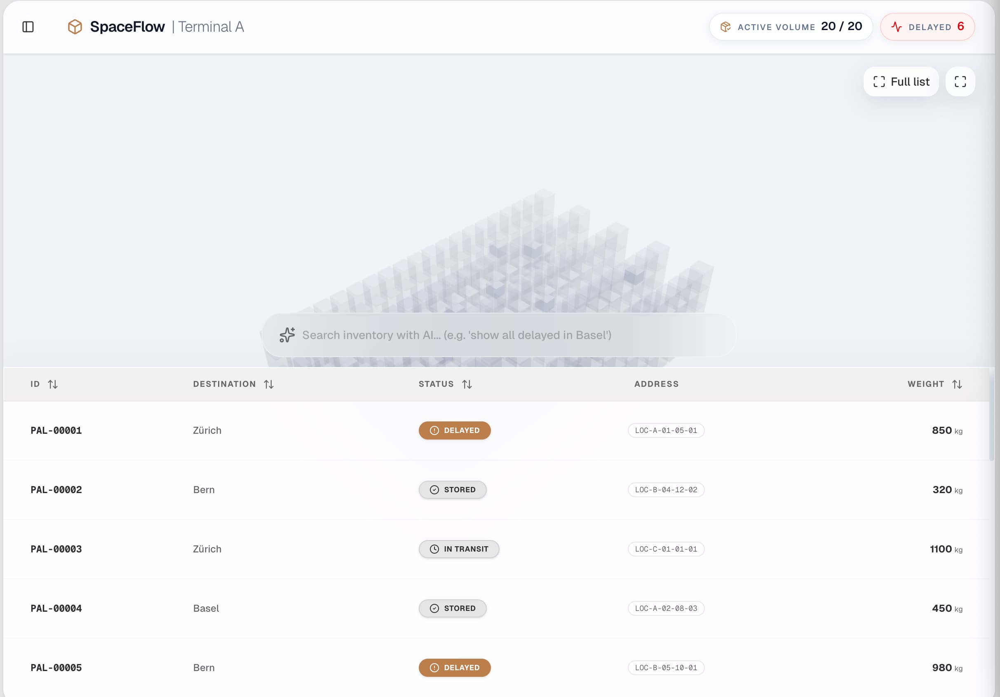

# SpaceFlow WMS

SpaceFlow WMS is a portfolio-grade Warehouse Management System dashboard built with Next.js App Router.  
It demonstrates how natural-language search can be translated into typed logistics filters and applied consistently across a 2D data grid and a 3D warehouse view.

<p align="center">
  <a href="https://github.com/pmdice/spaceflow-wms">
    
  </a>
</p>



## Overview

Traditional WMS interfaces often require users to navigate deep, multi-step filtering workflows.  
SpaceFlow introduces a constrained AI-assisted search flow that converts natural language into structured filter objects and applies them to operational data in real time.

## Architecture

### Backend-for-Frontend API

- User input is sent to `POST /api/parse-intent`.
- The route validates request shape and size before processing.
- OpenAI Structured Outputs and Zod enforce deterministic JSON contracts.
- The frontend only consumes server-validated filter objects.

### State and UI Composition

- `zustand` is used as the application state boundary for pallets, filters, and selection state.
- The table, 3D scene, and overlay components are decoupled and react to shared state updates.
- This keeps component responsibilities clear and avoids unnecessary synchronization logic.

### Performance Strategy

- 3D shelf structures use `THREE.InstancedMesh` to reduce draw calls.
- Pallets are currently rendered as individual meshes for interaction clarity.
- The tabular view uses virtualization via `@tanstack/react-virtual`.
- This combination supports large datasets while preserving interactive frame rates and DOM performance.

## Security

Security controls are documented in detail in [`SECURITY.md`](SECURITY.md).  
Current controls include:

- Global HTTP security headers, including CSP.
- API payload and input hardening for LLM-facing routes.
- Edge middleware controls for API routes.
- OWASP Top 10 (2021) mapping for interview and review traceability.

## Technology Stack

- Next.js (App Router, Route Handlers, Middleware)
- React + TypeScript
- Three.js, React Three Fiber, `@react-three/drei`
- Zustand
- Tailwind CSS + shadcn/ui
- OpenAI SDK + Zod
- `@tanstack/react-virtual`

## Local Development

### Prerequisites

- Node.js 18+ (or current LTS)
- npm

### Setup

```bash
npm install
```

### Environment

Create a `.env.local` file with required variables:

```bash
OPENAI_API_KEY=your_key_here
```

### Run

```bash
npm run dev
```

Open `http://localhost:3000`.

## Project Notes

- This repository is intentionally scoped as an interview-ready reference implementation.
- The focus is system design clarity, secure defaults, and performance-conscious frontend engineering.